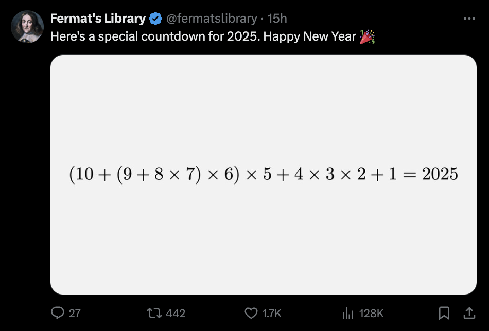

I recently came across this little puzzle on Twitter:


Is this:
- Something special about 2025, and not doable for many years?
- Or can you find such an expression for every year?

There should be roughly 9! expression-tree shapes, and roughly 3^9 assignments of operations to the internal nodes - that's a lot, so you should assume you can _probably_ find an expression for every year.

## The Script

This script then is a simple DP solution to find one expression for every number. 
To run it, use `python main.py` - it has no dependencies.

You can pretty easily edit it to look at larger ranges, or find solutions for other numbers. It also dumps an `output.txt` with all numbers you can build and one corresponding expression for each.

## Trivia

- The largest possible one is 5443200 (10 * 9 * 8 * 7 * 6 * 5 * 4 * 3 * (2 + 1))
- The smallest is -937440 (10 * 9 * 8 * 7 * 6) * (5 - (4 * 3 * (2 + 1)))
- It's possible to find an expression for every number between 1 and 10000, except for 8348, 8374, 8376, 9698, and 9944.

Here's some expressions for the next few years:
```
You can build 2024 with ((((10+((((9*8)*7)*(6-5))*4))-3)+2)-1)
You can build 2025 with (((((10*(9+((8+7)*6)))+(5*4))+3)*2)-1)
You can build 2026 with (((((10*(9+((8+7)*6)))+(5*4))+3)*2)*1)
You can build 2027 with (((((10*(9+((8+7)*6)))+(5*4))+3)*2)+1)
You can build 2028 with ((((10+(((((9*8)*7)+6)-5)*4))-3)+2)-1)
```